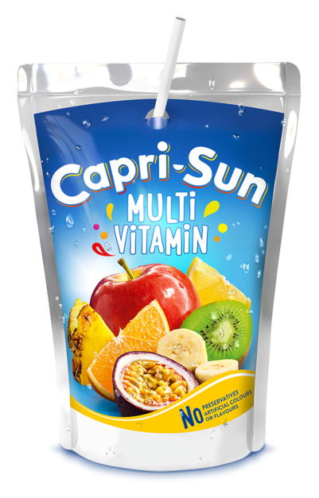

<h1 align="center">Salut 👋, je m'appelle Paul-Zelik</h1>
 
<h3 align="center">Aller le FC Versailles 🔵⚪️</h3>
 
- 🔭 Je travaille sur [Byflash](https://share.byflash.fr)

- 🌱 Je suis actuellement **à l'IUT d'Amiens**

- 📫 Comment me contacter **betinellipaul@byflash.fr**

- ⚡ Fun fact **Je kiffe le CapriSun**
 
<h3 align="left">Les trucs que je sais faire :</h3>

           

 

